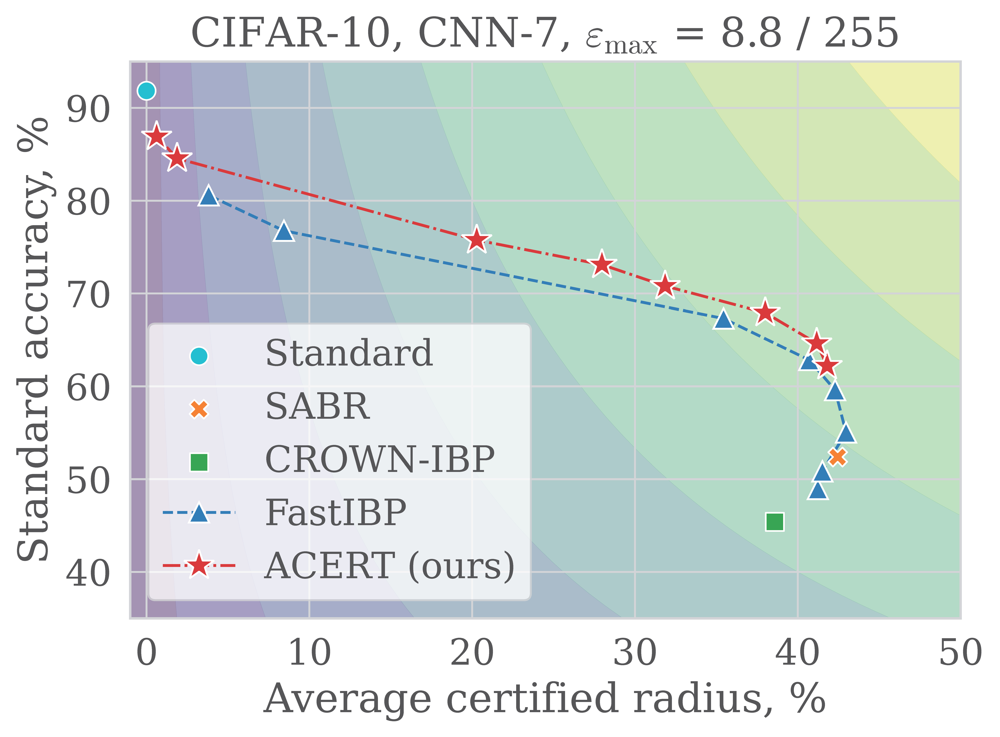
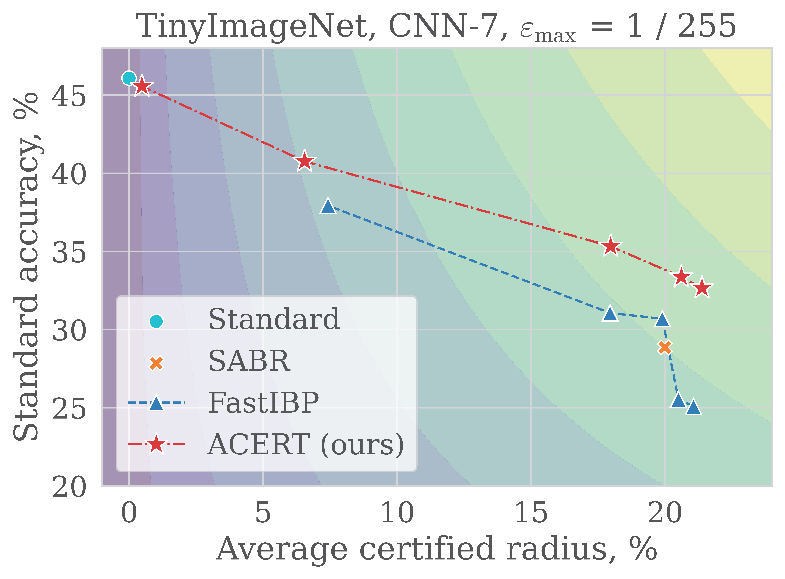

<div align="center">

# Adaptive Certified Training: Towards Better Accuracy-Robustness Tradeoffs


[](https://arxiv.org/abs/2307.13078)
[](https://ecmlpkdd.org/2024/)

</div>

The adaptive certified training method (ACERT) improves clean accuracy and certified robustness tradeoffs of deep learning models by adaptively assigning certification budget to each training sample individually.

<div style="display: flex; justify-content: center;  gap: 10px;">
    
</div>

## Installation
Python 3.7+ and PyTorch 1.11+ are required. We use `auto-LiRPA` library for bound propagation, which recommends using [PyTorch 1.11](https://pytorch.org/get-started/previous-versions/#v1110).
- (Optional) An example of conda environment with Python 3.9 and PyTorch 1.11 installed:

```bash
conda create -n acert-env python=3.9 -y
conda activate acert-env
```

For CUDA 11.3:
```bash
conda install -y pytorch==1.11.0 torchvision==0.12.0 torchaudio==0.11.0 cudatoolkit=11.3 -c pytorch
```

- Install dependencies in `requirements.txt`. Uncomment extra requirements if needed 
```bash
pip install -r requirements.txt
```

- (Optional) Download datasets and set paths in dataset configs at [configs/datamodule/](configs/datamodule/). You can specify the paths using environment variables by providing values of `CIFAR_DATA_DIR` and `TINYIMAGENET_DATA_DIR` in `.env` file (rename `.env.example`).

## Run code
Find all experiment configurations in [configs/experiment/](configs/experiment/), and run the experiments with the corresponding config names:
```bash
python src/train.py experiment=<config_name_to_paste>
```
```bash
python src/eval.py experiment=eval/<config_name_to_paste>
```

### Train ACERT models
E.g. to train ACERT model with kappa=0.25 on CIFAR-10 dataset, run
```bash
python src/train.py experiment=eps_ibp_cifar10 model.kappa=0.25
```

### Evaluate ACERT models
E.g. to evaluate ACERT model with kappa=0.25 on CIFAR-10 dataset, run
```bash
python src/eval.py experiment=eval/eps_ibp_cifar10 model.kappa=0.25
```

## Citation

If this code is useful in your research we would kindly ask you to cite our paper.

```bibtex
@InProceedings{nurlanov2024adaptive,
  title =     {Adaptive Certified Training: Towards Better Accuracy-Robustness Tradeoffs},
  author =    {Nurlanov, Zhakshylyk and Schmidt, Frank R. and Bernard, Florian},
  booktitle = {European Conference on Machine Learning and Principles and Practice of Knowledge Discovery in Databases},
  year =      {2024},
  month =     {September}
}
```

## License
This project is open sourced under the [AGPL-3.0](LICENSE).
For a list of other open source components included in the project, see the file [3rd-party-licenses.txt](3rd-party-licenses.txt)


## Purpose of the project
This software is a research prototype, solely developed for and published as part of the publication cited above. It will neither be maintained nor monitored in any way.

## Contact
Please feel free to open an issue or contact us personally if you have questions, need help, or need explanations.

zh.nurlanov@uni-bonn.de